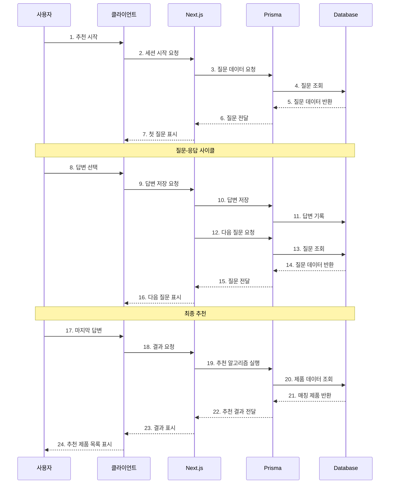

```mermaid
    sequenceDiagram
        participant U as 사용자
        participant C as 클라이언트
        participant N as Next.js
        participant P as Prisma
        participant DB as Database

        U->>C: 1. 추천 시작
        C->>N: 2. 세션 시작 요청
        N->>P: 3. 질문 데이터 요청
        P->>DB: 4. 질문 조회
        DB-->>P: 5. 질문 데이터 반환
        P-->>N: 6. 질문 전달
        N-->>C: 7. 첫 질문 표시

        Note over U,DB: 질문-응답 사이클
        U->>C: 8. 답변 선택
        C->>N: 9. 답변 저장 요청
        N->>P: 10. 답변 저장
        P->>DB: 11. 답변 기록
        N->>P: 12. 다음 질문 요청
        P->>DB: 13. 질문 조회
        DB-->>P: 14. 질문 데이터 반환
        P-->>N: 15. 질문 전달
        N-->>C: 16. 다음 질문 표시

        Note over U,DB: 최종 추천
        U->>C: 17. 마지막 답변
        C->>N: 18. 결과 요청
        N->>P: 19. 추천 알고리즘 실행
        P->>DB: 20. 제품 데이터 조회
        DB-->>P: 21. 매칭 제품 반환
        P-->>N: 22. 추천 결과 전달
        N-->>C: 23. 결과 표시
        C-->>U: 24. 추천 제품 목록 표시
```
